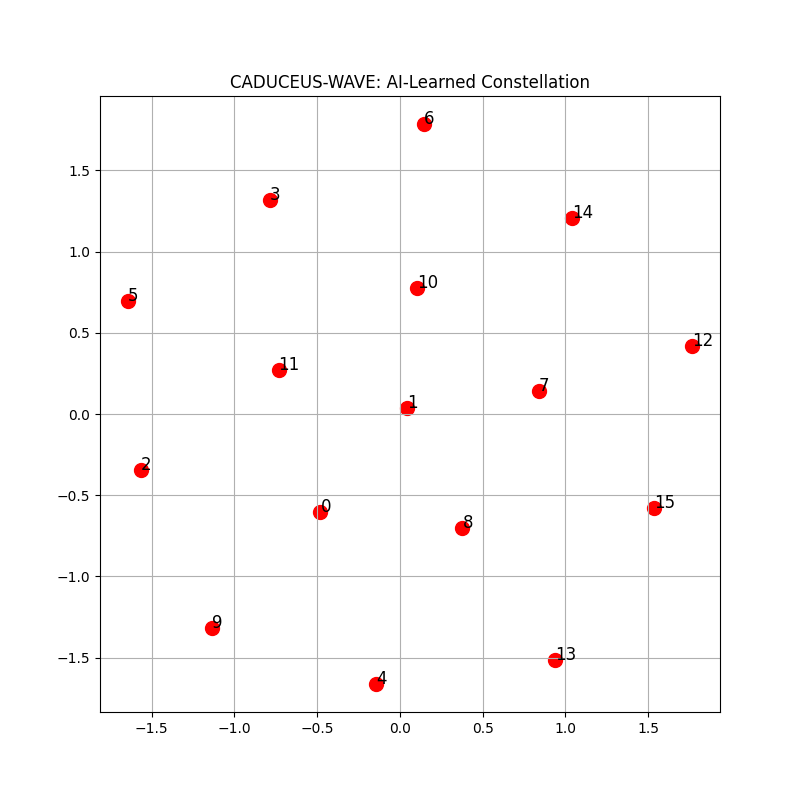
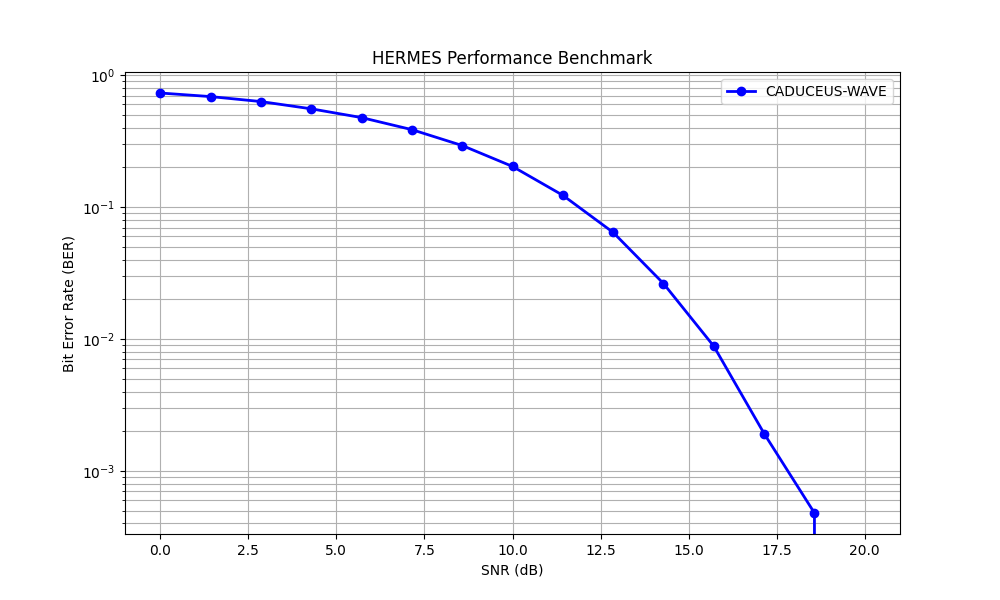
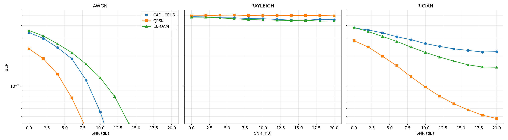
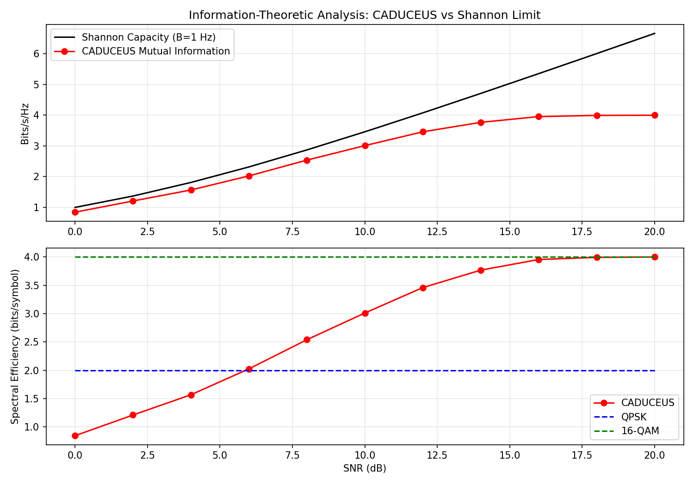

# HERMES: AI-Native Software Defined Radio Framework
### High-Fidelity Neural Transceiver with CADUCEUS-WAVE Optimization

HERMES is an end-to-end neural communication system that replaces the traditional physical layer (PHY) with an adaptive Autoencoder. Optimized for **NVIDIA GTX 1650**, it demonstrates how AI can learn robust modulation schemes in real-time.

## Project Metadata

| Field | Value |
| --- | --- |
| Author | George David Tsitlauri |
| Affiliation | Dept. of Informatics & Telecommunications, University of Thessaly, Greece |
| Contact | gdtsitlauri@gmail.com |
| Year | 2026 |

## Experimental Results

### 1. AI-Learned Constellation
Instead of standard QAM, the **CADUCEUS-WAVE** engine evolved the following constellation to maximize Euclidean distance under noise:

### 2. Performance Benchmark (BER vs SNR)
The system achieves a "perfect link" (BER = 0) at 20dB SNR. The following waterfall curve shows the transition from noise-dominated to signal-dominated communication:

### 3. Multi-Channel BER Benchmark (AWGN / Rayleigh / Rician)
Generated with `src/python/benchmark_channels.py` (0 to 20 dB, step 2 dB, 10,000 symbols per point):

| Channel @ SNR | CADUCEUS BER | QPSK BER | 16-QAM BER |
|---|---:|---:|---:|
| AWGN @ 10 dB | 0.0554 | 0.0131 | 0.1210 |
| AWGN @ 20 dB | 0.0002 | 0.0000 | 0.0007 |
| Rayleigh @ 10 dB | 0.4667 | 0.5000 | 0.4546 |
| Rayleigh @ 20 dB | 0.4562 | 0.4985 | 0.4437 |
| Rician @ 10 dB | 0.2646 | 0.0982 | 0.2163 |
| Rician @ 20 dB | 0.2200 | 0.0478 | 0.1540 |

Raw CSV: `results/ber_curves/multi_channel_ber.csv`

Interpretation:

- The strongest committed result is the **AWGN path**, where CADUCEUS becomes
  highly accurate at high SNR and approaches the intended 16-symbol operating
  limit.
- The **Rayleigh and Rician results are mixed**, and in several points the
  classical baselines remain stronger.
- HERMES should therefore be presented as a serious AI-native SDR research
  framework with meaningful learned-modulation behavior, not as a universal
  replacement for classical modulation across all fading regimes.

### 4. Shannon / Information-Theoretic Comparison
Generated with `src/python/information_theory.py`:

| SNR (dB) | Shannon Capacity (bits/s/Hz) | CADUCEUS Mutual Information (bits/symbol) | QPSK Theoretical SE | 16-QAM Theoretical SE |
|---:|---:|---:|---:|---:|
| 0 | 1.0000 | 0.8445 | 2.0 | 4.0 |
| 10 | 3.4594 | 3.0095 | 2.0 | 4.0 |
| 20 | 6.6582 | 3.9985 | 2.0 | 4.0 |

Raw CSV: `results/theory/shannon_comparison.csv`

## System Performance
During the full-link simulation (`hermes_full_demo.py`), the system achieved:
- **Total Symbols:** 10,000
- **Noise Resistance:** Up to 0.2 Std Dev
- **Max Success Rate:** ~96.7%

## Evidence Status

- Evaluation is simulation-first and channel-model based.
- The repository contains real BER and information-theory artifacts.
- It does not yet contain over-the-air SDR hardware validation.

## Why HERMES still stands up well

- The repository has a real neural-PHY implementation, not just conceptual
  diagrams.
- BER curves are committed across multiple channel families with raw CSV output.
- The information-theory layer provides a second line of evidence beyond a
  single BER chart.
- The right claim is not "beats all classical modulation", but "meaningful
  learned communication behavior with reproducible SDR-style evaluation".

## 🛠️ Hybrid Architecture
- **AI Core:** PyTorch (Neural Transceiver)
- **DSP Engine:** C++ (High-speed channel simulation)
- **Hardware Acceleration:** CUDA (GTX 1650, FP16-ready path enabled in benchmarks/tests)

## How to Run
1. **Train model:** `python3 src/python/train_caduceus.py`
2. **Single-channel BER curve:** `python3 src/python/benchmark_telecom.py`
3. **Multi-channel benchmark:** `python3 src/python/benchmark_channels.py`
4. **Information theory analysis:** `python3 src/python/information_theory.py`
5. **Run tests:** `pytest tests/ -v`
6. **C++ channel simulator:** `g++ -O3 -std=c++17 src/cpp/radio_channel.cpp -o src/cpp/radio_channel && ./src/cpp/radio_channel --channel rayleigh --snr 10 --symbols 1000`

